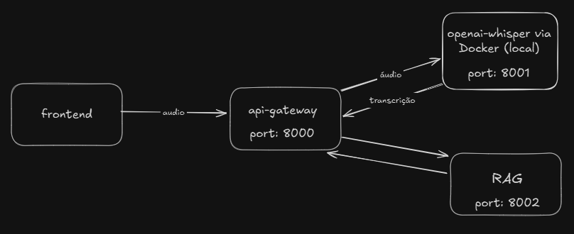
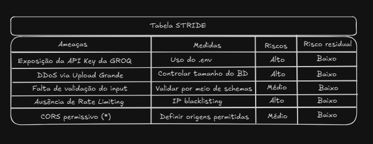
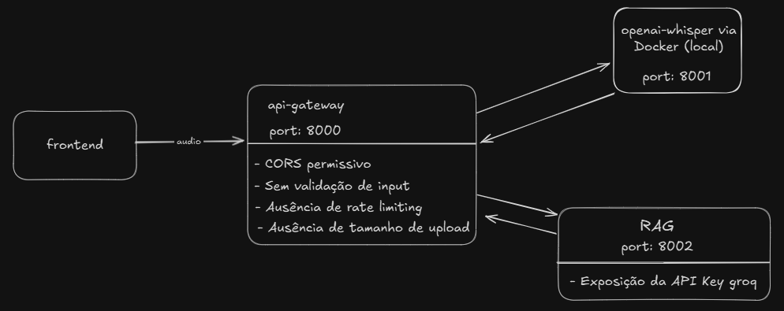

<h1 align="center">
  RAGPRESSO
</h1>


## Visão Geral
Este projeto desenvolve um sistema inteligente de consulta por áudio voltado para a **cafeicultura brasileira**, integrando transcrição automática **(Whisper)** com geração de respostas contextuais **(RAG)** através de uma arquitetura distribuída de microsserviços. O sistema permite que produtores rurais façam perguntas técnicas por meio de áudio durante suas atividades de campo, recebendo respostas especializadas baseadas em uma base de conhecimento cafeeiro.

## Índices

- [Arquitetura](#arquitetura-do-sistema)
- [Descrição dos componentes](#descrição-dos-componentes)
- [Funcionamento](#funcionamento)
- [Modelagem de ameaças](#modelagem-de-ameaças)
- [Estrutura do projeto](#estrutura-do-projeto)
- [Passos para execução](#passos-para-execução)
- [Tecnologias utilizadas](#tecnologias-utilizadas)
- [Relevância do problema](#relevância-do-problema)


## Arquitetura do Sistema

O sistema é composto por três microsserviços principais :


---

## Descrição dos Componentes

### **Whisper**
- Responsável pela **transcrição dos áudios** utilizando o modelo **OpenAI Whisper**.  
- Containerizado e exposto na **porta 8001**.

---

### **RAG**
- Executa a **geração de respostas contextuais** utilizando o modelo **LLaMA-3.3-70B (Groq API)**.  
-  Utiliza o modelo **SentenceTransformer** para converter os textos em vetores de 384 dimensões (embeddings).
- Armazena as bases de conhecimento no **ChromaDB** com persistência local com chunks sobrepostos para melhor precisão na recuperação.
- Envia para a LLM por meio da Groq a transcrição do áudio juntamente com contexto recuperado da base vetorial.  
- Exposto na **porta 8002**.

---

### **Gateway**
- Ponto central de comunicação com os microsserviços Whisper e RAG
- Exposto na **porta 8000**.

---

## Funcionamento

https://github.com/user-attachments/assets/e4e25ce2-36df-4499-858f-980de3026306

---

## Modelagem de ameaças

### Visão pré-modelagem de ameaças



### Modelagem de ameaças



### Visão com implementação das medidas de mitigação




---

## Estrutura do Projeto

```
audio-rag-system/
├── Dockerfile
├── docker-compose.yml
├── gateway.py
├── whisper_service.py
├── rag_service.py
├── requirements-gateway.txt
├── requirements-whisper.txt
├── requirements-rag.txt
└── docs/
    └── README.md 
```

---

## Passos para Execução 

```bash
git clone https://github.com/FredMaia/audio-rag-system.git
cd audio-rag-system
```
Para subir o docker utilize :

```bash
./deploy_docker.bat
```

Para rodar o projeto completo utilize :

```bash
./start_project.bat
```


> **Aviso:** É necessário ter Docker instalado na máquina e uma chave de API da GROQ no arquivo **.env**


## Tecnologias Utilizadas

| Tecnologia | Função Principal |
|-------------|------------------|
| **FastAPI** | Framework Python dos serviços |
| **OpenAI Whisper** | Transcrição de áudio |
| **SentenceTransformers** | Geração de embeddings (all-MiniLM-L6-v2) |
| **ChromaDB** | Banco de dados vetorial para embeddings |
| **Groq API (LLaMA 3.3)** | Geração de respostas contextuais |
| **PyPDF2** | Processamento e extração de texto PDF |
| **Docker** | Isolamento dos microsserviços |

---

## Relevância do Problema

A cafeicultura brasileira enfrenta desafios significativos no acesso e na disseminação de conhecimento técnico, especialmente entre pequenos e médios produtores. Este projeto aborda uma dor real do setor: a dificuldade de acessar informações técnicas de forma rápida, contextualizada e aplicável durante as atividades de campo.

Uma evidência desse desafio é apresentada no Agro Estadão: “MG: produtividade do café cresce até 28% com assistência técnica” — há relatos concretos de que a assistência técnica levou a aumentos de produtividade, redução de custos, e mais conhecimento para o produtor. [Fonte](https://agro.estadao.com.br/gente/mg-produtividade-do-cafe-cresce-ate-28-com-assistencia-tecnica)

Além disso, Segundo dados da EMBRAPA, apenas 32% dos produtores de café no Brasil têm acesso regular a assistência técnica especializada. Aliado à isso, a fragmentação das informações em múltiplas fontes (manuais, artigos, guias) dificulta a consulta rápida durante o trabalho de campo.

Dessa forma, a aplicação tem objetivo de permitir aos produtores rurais realizar consultas técnicas por meio de interfaces de voz, especialmente durante atividades práticas em que as mãos estão ocupadas e há necessidade de tomadas de decisão em tempo crítico.

### **Outras Fontes**

[Como a Assistência Técnica Beneficia os Produtores de Café?](https://perfectdailygrind.com/pt/2020/08/18/assistencia-tecnica-cafe-beneficia-produtores/)

[Uso de IA na indústria cafeeira impulsiona produtividade e qualidade dos grãos](https://portal.agrosummit.com.br/public/uso-de-ia-na-industria-cafeeira-impulsiona-produtividade-e-qualidade-dos-graos)

[Brasil precisa de mais conectividade na cafeicultura para avançar](https://perfectdailygrind.com/pt/2022/06/30/brasil-precisa-de-mais-conectividade-na-cafeicultura-para-avancar/)

---

## Integrantes
- **Rafael Rezende**  
- **Frederico Maia**  
- **Mateus Mendes**  

---
