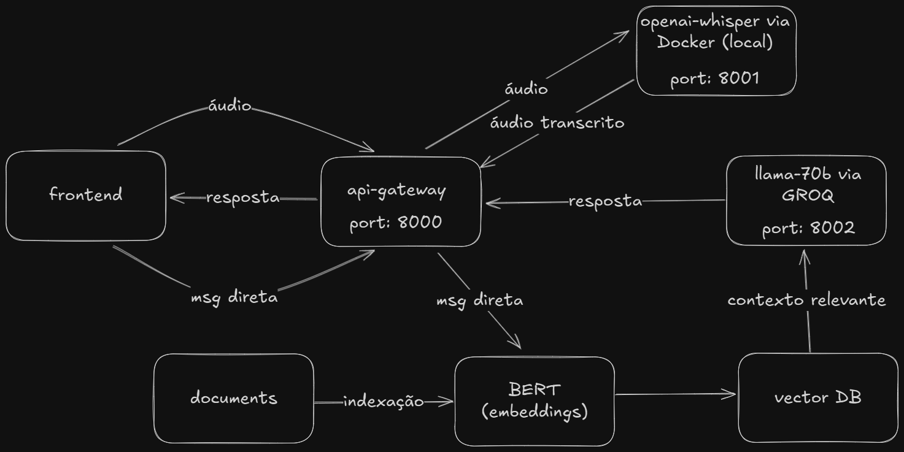

## Visão Geral
Este projeto desenvolvido como parte das atividades acadêmicas da disciplina de Sistemas Distribuídos.
Seu objetivo é integrar transcrição de áudio **(Whisper)** para geração de respostas inteligentes **(RAG via GROQ API)** por meio de uma arquitetura distribuída baseada em microsserviços.
A solução permite o envio de um áudio, sua transcrição automática e o processamento semântico do texto resultante, retornando uma resposta inteligente ao usuário.

## Índices

- [Arquitetura](#arquitetura-do-sistema)
- [Descrição dos componentes](#descrição-dos-componentes)
- [Funcionamento](#funcionamento)
- [Estrutura do projeto](#estrutura-do-projeto)
- [Passos para execução](#passos-para-execução)
- [Tecnologias utilizadas](#tecnologias-utilizadas)


## Arquitetura do Sistema

O sistema é composto por três microsserviços principais, orquestrados via **Docker Compose**:



---

## Descrição dos Componentes

### **1. Whisper Service (`whisper_service.py`)**
- Responsável pela **transcrição automática de áudios** utilizando o modelo **OpenAI Whisper (base)**.  
- Suporta múltiplos formatos: `.mp3`, `.wav`, `.webm`, `.mp4`, dentre outros. 
- Containerizado e exposto na **porta 8001**.

---

### **2. RAG Service (`rag_service.py`)**
- Executa a **geração de respostas contextuais** utilizando o modelo **LLaMA-3.3-70B (Groq API)**.  
- Recebe a transcrição e processa com um **contexto base embutido**.  
- Implementado com **FastAPI** e **Groq SDK**.  
- Exposto na **porta 8002**.

---

### **3. Gateway (`gateway.py`)**
- Ponto central de comunicação do sistema.  
- Responsável por:  
  1. Receber o áudio do usuário.  
  2. Encaminhar para o Whisper Service → obter transcrição.  
  3. Enviar transcrição ao RAG Service → obter resposta.  
  4. Retornar ambos ao cliente.  
- Exposto na **porta 8000**.

---

## Funcionamento

(video)

1. O usuário envia um arquivo de áudio (`.mp3`, `.wav`, etc.) para o endpoint `/process-audio` do **Gateway**.  
2. O **Gateway** encaminha o áudio ao **Whisper Service** para transcrição.  
3. O texto transcrito é enviado ao **RAG Service**, que gera uma resposta contextual utilizando a **Groq API**.  
4. O **Gateway** retorna o resultado final:

```json
{
  "transcription": "texto reconhecido",
  "answer": "resposta gerada",
  "model": "llama-3.3-70b-versatile"
}
```

---

## Estrutura do Projeto

```
audio-rag-system/
├── Dockerfile
├── docker-compose.yml
├── gateway.py
├── whisper_service.py
├── rag_service.py
├── requirements-gateway.txt
├── requirements-whisper.txt
├── requirements-rag.txt
└── docs/
    └── README.md 
```

---

## Passos para Execução 

```bash
git clone https://github.com/FredMaia/audio-rag-system.git
cd audio-rag-system
docker-compose up --build
```

> :warning: **Aviso:** É necessário ter Docker instalado na máquina e uma chave de API da GROQ no arquivo **.env**


---

## Tecnologias Utilizadas

| Tecnologia | Função Principal |
|-------------|------------------|
| **Python 3.10** | Linguagem base |
| **FastAPI** | Framework web dos serviços |
| **OpenAI Whisper** | Transcrição de áudio |
| **Groq API (LLaMA 3.3)** | Geração de respostas |
| **Docker Compose** | Orquestração de microsserviços |

---

## Integrantes
- **Rafael Rezende**  
- **Frederico Maia**  
- **Mateus Mendes**  

---